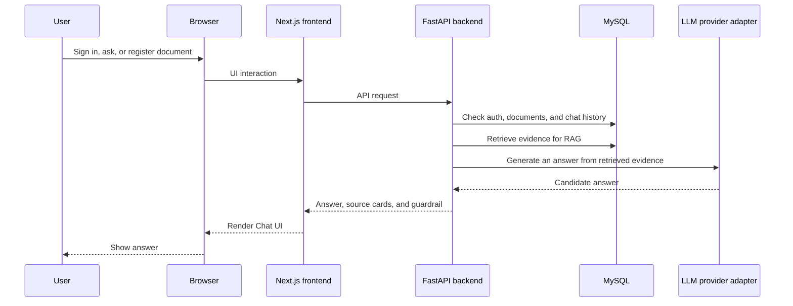

# Portfolio Chatbot

[日本語版はこちら](./README.md)

> This repository is a public portfolio overview. The full application source code is managed in a private repository.
> It shares the live demo, public-safe design overview, and technology stack.

このリポジトリは公開用ポートフォリオ概要です。アプリケーション本体のソースコードは非公開リポジトリで管理しています。
ここでは、動作デモ、設計概要、公開可能な仕様、技術スタックを確認できます。

## Overview

Portfolio Chatbot is a production-minded AI chatbot / virtual assistant built to demonstrate secure, source-grounded document question answering.

It is designed for use cases where each logged-in user can register their own documents, ask questions through RAG (Retrieval-Augmented Generation), and receive answers with visible supporting sources. When the system does not have enough evidence, it uses an unsupported guardrail to avoid unsupported answers.

The current public demo is an MVP. It exposes the core production-oriented workflow first, then will continue to improve UI, supported document handling, answer quality, and operational quality based on usage and verification.

The GitHub repository is intentionally an overview package, not an OSS source release.

## Live Demo

- Portfolio hub: https://creativelife.work/
- Chatbot demo: https://chatbot.creativelife.work/login

Notes:

- Google login is required to try concrete operations such as chat and document management.
- Usage may be rate-limited to protect external LLM provider quotas.
- Some admin or operations routes are intentionally not public demo paths.
- Document registration is intended for public URLs or test URLs that the user has the right to register and use.
- To reduce security risk and impact on external sites, URL fetching targets, file size, fetch time, and usage may be limited.

## Key Features

- Google OAuth login with httpOnly Cookie session
- Owner-scoped personal documents
- RAG scoped to the logged-in user's own documents
- text extraction, chunking, and retrieval including vector search
- Answer generation from retrieved evidence in registered documents
- Source cards with document name, URL, and excerpt
- unsupported guardrail behavior that avoids guessing when evidence is insufficient
- Answer model (LLM model) selection through a gateway/adapter boundary
- User/day usage limiting for public deployment

## Tech Stack

- Frontend: Next.js / React / TypeScript / Tailwind CSS / custom UI components / SPA-style UI
- Backend: FastAPI / SQLAlchemy / Alembic
- Database: MySQL
- Auth: Google OAuth / httpOnly Cookie session
- AI: RAG / text extraction / chunking / vector search / source cards / unsupported guardrail
- Infra: Docker Compose / Nginx / VPS / HTTPS

## Design Overview

The frontend uses Tailwind CSS and a small custom UI component set to keep Chat, Documents, login, source cards, and unsupported-answer states visually consistent.

The backend partially adopts ideas from DDD, Clean Architecture, and related architectural patterns. It separates boundaries for auth, document management, Chat, RAG, and LLM provider integration.

This makes authorization, RAG retrieval, grounding, source citation, and LLM provider switching easier to evolve independently, while keeping the structure maintainable and extensible.

## Architecture Overview



High-level flow:

1. A user signs in with Google OAuth.
2. The backend issues a secure session cookie.
3. The user registers documents in their own document scope.
4. A chat request uses only that user's available document scope.
5. When registered documents contain usable evidence, the app returns an answer with source cards.
6. Source cards show the document name, URL, and excerpt used for the answer.
7. If evidence is insufficient, the answer is suppressed and no misleading source card is shown.

This overview explains only what is needed to understand the public demo.

## Repository Structure

This public repository contains overview material only.

```text
portfolio-chatbot-overview/
├── README.md
├── README.en.md
├── assets/
│   └── screenshots/
│       ├── README.md
│       ├── README.en.md
│       ├── chat.png
│       ├── documents.png
│       ├── login.png
│       ├── source-card.png
│       └── unsupported-answer.png
├── docs/
│   ├── public/
│   │   ├── 01_requirements.md
│   │   ├── 01_requirements.en.md
│   │   ├── 02_architecture-overview.md
│   │   ├── 02_architecture-overview.en.md
│   │   ├── 03_api-overview.md
│   │   ├── 03_api-overview.en.md
│   │   ├── 04_ui-overview.md
│   │   └── 04_ui-overview.en.md
```

## Screenshots and Usage

Screenshots are captured from the public demo. Some names, URLs, and document names are masked for publication.

1. Sign in from the demo URL with Google.


2. Register a document on the Documents screen.


3. Ask questions about the registered document on the Chat screen.


4. When supporting evidence is available, the answer includes source cards.


5. When evidence is insufficient, the app returns an unsupported answer instead of guessing.


## Public Documentation

- [Requirements](docs/public/01_requirements.en.md)
- [Architecture Overview](docs/public/02_architecture-overview.en.md)
- [API Overview](docs/public/03_api-overview.en.md)
- [UI Overview](docs/public/04_ui-overview.en.md)

## Publication Scope

This repository is a public overview. It does not include the full application source code, operational details, or implementation internals.
