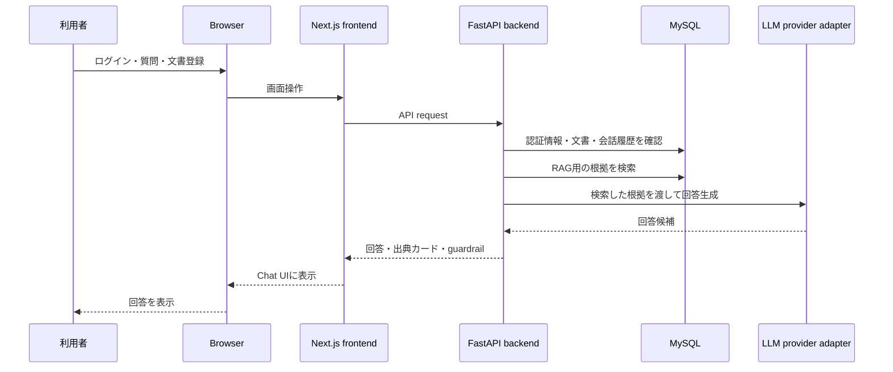
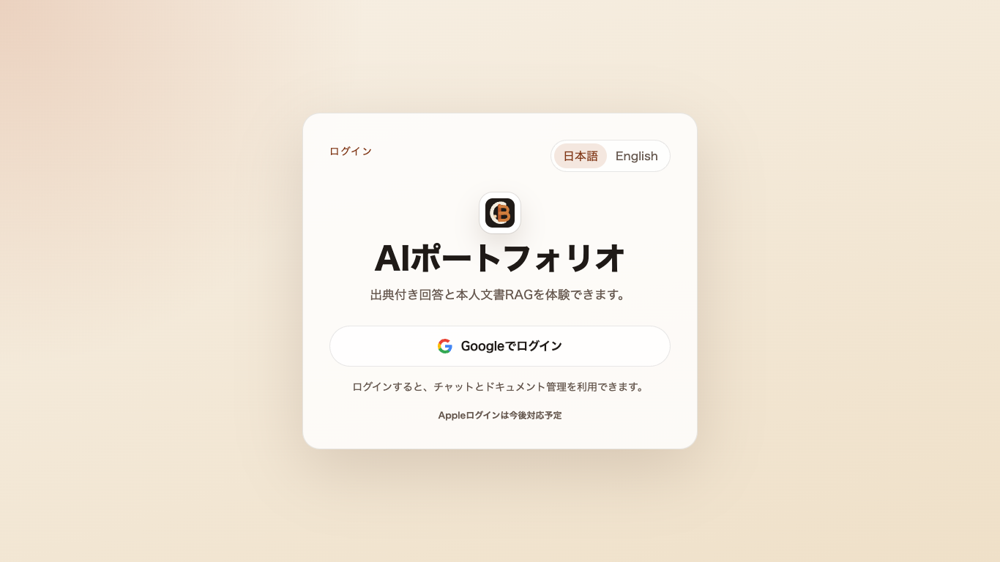
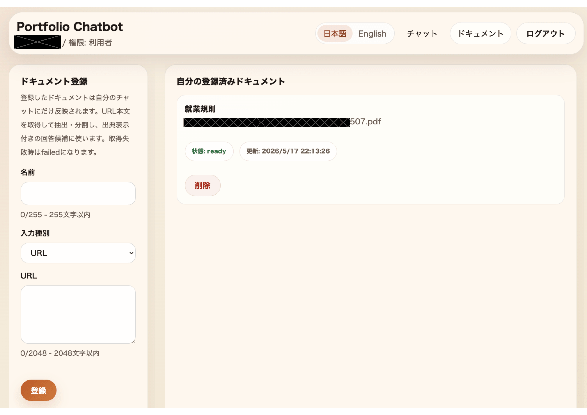
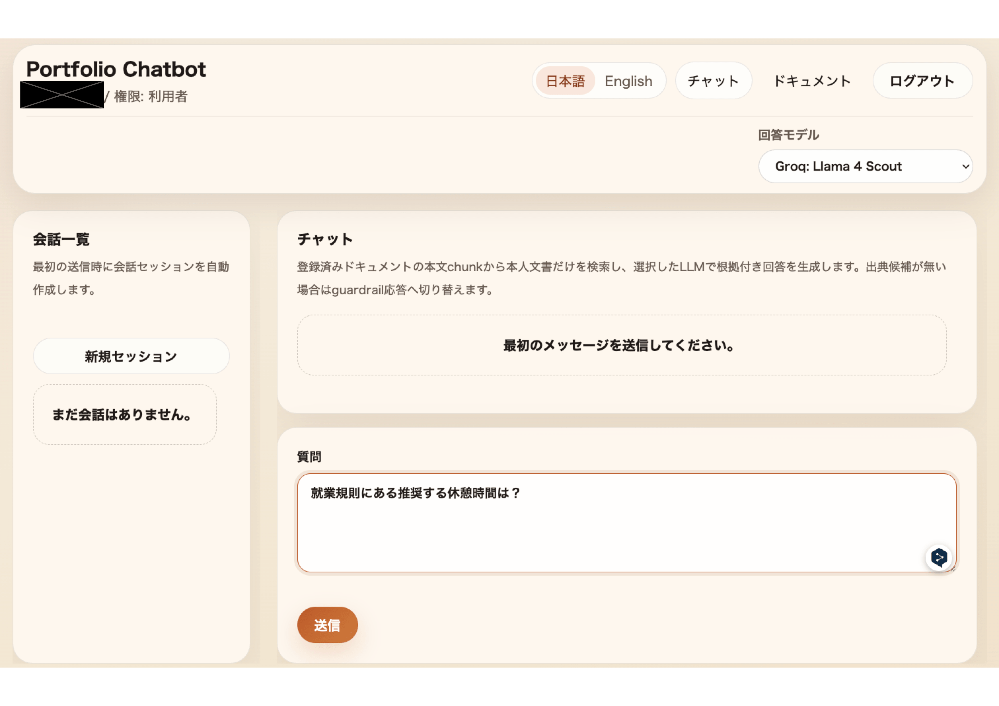
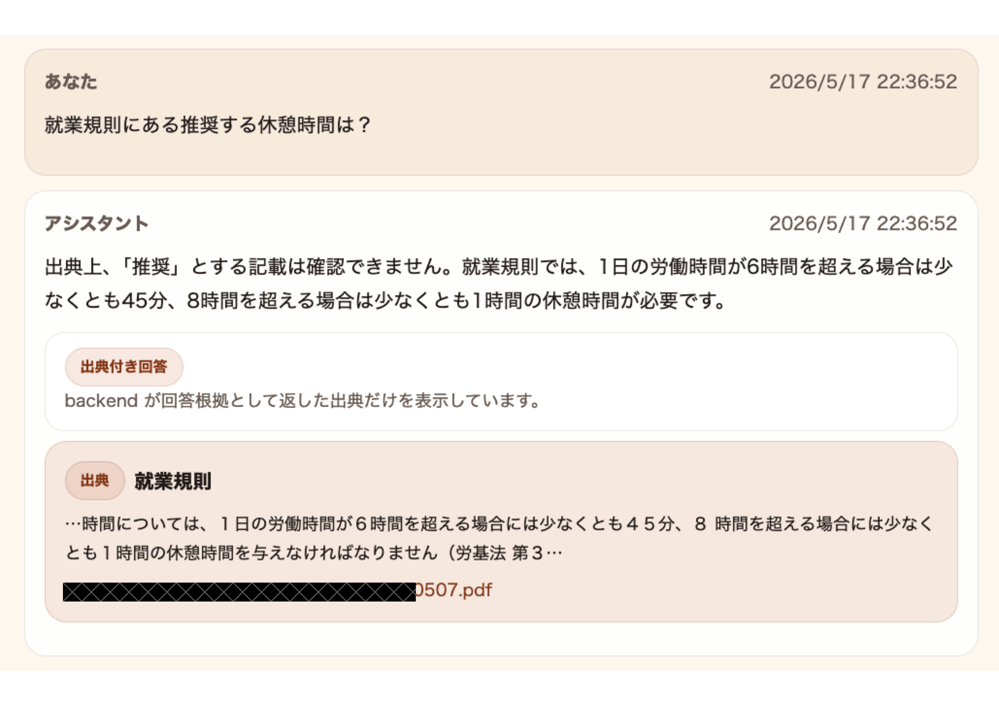
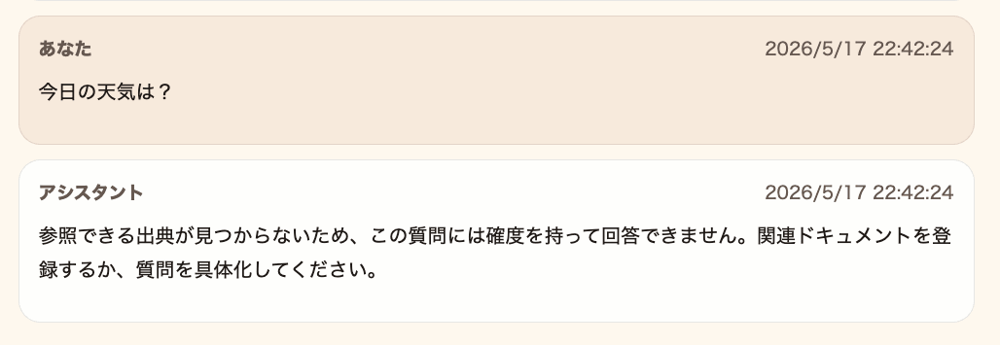

# Portfolio Chatbot

[English](./README.en.md)

> このリポジトリは公開用ポートフォリオ概要です。アプリケーション本体のソースコードは非公開リポジトリで管理しています。
> ここでは、動作デモ、設計概要、公開可能な仕様、技術スタックを確認できます。

This repository is a public portfolio overview. The full application source code is managed in a private repository.
It shares the live demo, public-safe design overview, and technology stack.

## 概要

Portfolio Chatbotは、実運用を意識したAIチャットボット/バーチャルアシスタントのポートフォリオ概要です。

ログインユーザー本人の文書だけを対象にしたRAG（Retrieval-Augmented Generation：検索拡張生成）で質問でき、回答には根拠となる出典カードを表示します。根拠が不足する場合は、無理に断定回答せず、unsupported guardrail（根拠不足時の回答抑制）で抑制する設計です。

現在の公開デモはMVPです。実運用を想定した基本機能を先に公開し、利用状況や検証結果を見ながら、UI、対応文書、回答品質、運用品質を継続的に改善していく前提です。

このGitHub公開版はOSS公開ではなく、デモURL、設計思想、公開可能な仕様、技術スタックを見せるための概要リポジトリです。

## デモURL

- Portfolio hub: https://creativelife.work/
- Chatbot demo: https://chatbot.creativelife.work/login

注意:

- チャットや文書登録など、具体的な操作を試すにはGoogleログインが必要です。
- 外部LLM providerの無料枠・credit保護のため、利用回数制限があります。
- adminや運用系の導線は公開デモ対象外です。
- ドキュメント登録は、本人が登録・利用する権利を持つ公開URLまたは検証用URLでの利用を想定しています。
- セキュリティと外部サイトへの影響を抑えるため、URL取得対象、ファイルサイズ、取得時間、利用回数を制限する場合があります。

## 主な機能

- Google OAuthとhttpOnly Cookie session
- ログインユーザー本人に閉じた文書管理
- ログインユーザー本人の文書だけを対象にしたRAG
- text extraction（本文抽出）、chunking（チャンク化）、ベクトル検索を含むretrieval（検索）
- 登録文書内のevidence（根拠）に基づく回答生成
- 文書名・URL・抜粋を含む出典カード
- unsupported guardrail（根拠不足時の回答抑制）により推測回答を回避
- 回答モデル（LLMモデル）の選択とLLM provider gateway/adapterによる切替
- 公開環境向けのuser/day利用制限

## 技術スタック

- Frontend: Next.js / React / TypeScript / Tailwind CSS / custom UI components / SPA構成
- Backend: FastAPI / SQLAlchemy / Alembic
- Database: MySQL
- Auth: Google OAuth / httpOnly Cookie session
- AI: RAG / text extraction（本文抽出） / chunking（チャンク化） / ベクトル検索 / 出典付き回答 / unsupported guardrail（根拠不足時の回答抑制）
- Infra: Docker Compose / Nginx / VPS / HTTPS

## 設計概要

FrontendはTailwind CSSと自前のUI component群を使い、Chat、Documents、ログイン、出典カード、根拠不足時表示の見た目と操作感を揃えています。

Backendは、DDDやクリーンアーキテクチャなどの考え方を部分的に採用し、認証、文書管理、Chat、RAG、LLM provider連携の境界を分けています。

これにより、認可、RAGの検索・根拠付け・出典表示、LLM provider切替を独立して変更しやすくし、保守性と拡張性を保ちやすい構成にしています。

## 構成概要



公開可能な範囲での流れ:

1. ユーザーがGoogle OAuthでログインする。
2. バックエンドがセキュアなセッションCookieを発行する。
3. ユーザーが自分専用の文書を登録する。
4. チャットリクエストは、そのユーザーの文書スコープだけを使う。
5. 登録文書内に根拠がある場合は、回答と出典カードを返す。
6. 出典カードには、回答に使った文書名、URL、抜粋を表示する。
7. 根拠が不足する場合は回答を抑制し、誤解を招く出典カードを出さない。

このoverviewでは、公開デモの理解に必要な範囲だけを説明しています。

## リポジトリ構成

この公開版は概要資料だけを含みます。

```text
portfolio-chatbot-overview/
├── README.md
├── README.en.md
├── assets/
│   └── screenshots/
│       ├── README.md
│       ├── README.en.md
│       ├── chat.png
│       ├── documents.png
│       ├── login.png
│       ├── source-card.png
│       └── unsupported-answer.png
├── docs/
│   ├── public/
│   │   ├── 01_requirements.md
│   │   ├── 01_requirements.en.md
│   │   ├── 02_architecture-overview.md
│   │   ├── 02_architecture-overview.en.md
│   │   ├── 03_api-overview.md
│   │   ├── 03_api-overview.en.md
│   │   ├── 04_ui-overview.md
│   │   └── 04_ui-overview.en.md
```

## スクリーンショットと使い方

公開デモから取得したスクリーンショットを掲載します。一部の氏名、URL、文書名は公開用にマスクしています。

1. デモURLからGoogleログインします。



2. ドキュメント画面で、質問対象にしたい文書を登録します。



3. Chat画面で、登録文書について質問します。



4. 根拠がある場合は、回答と出典カードが表示されます。



5. 根拠が不足する場合は、根拠不足時の回答になります。



## 公開ドキュメント

- [要件概要](docs/public/01_requirements.md)
- [構成概要](docs/public/02_architecture-overview.md)
- [API概要](docs/public/03_api-overview.md)
- [UI概要](docs/public/04_ui-overview.md)

## 公開範囲

このリポジトリは公開用概要です。アプリケーション本体のソースコード、運用詳細、実装内部は含めていません。
