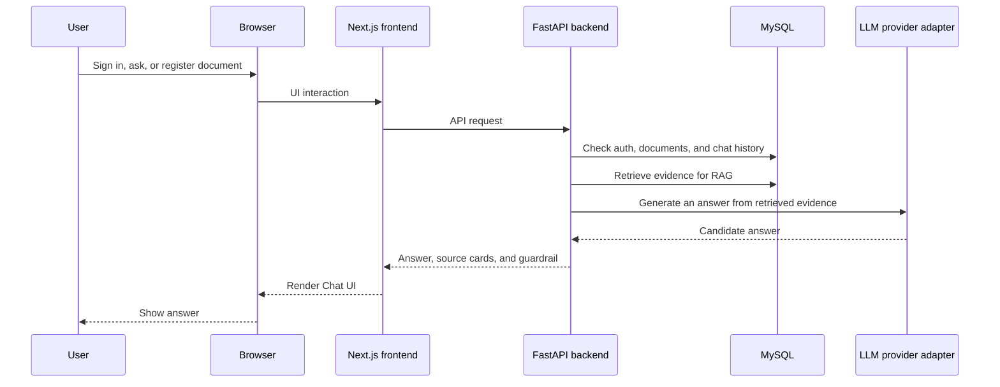

# Architecture Overview

[日本語版はこちら](./02_architecture-overview.md)

## High-Level Components

## Technology Stack

Representative technologies only.

| Area | Stack |
| --- | --- |
| Frontend | Next.js 15.5.9, React 19.1.1, TypeScript 5.9.2, Tailwind CSS 4.3.0 |
| Backend | Python 3.11, FastAPI 0.116.1, SQLAlchemy 2.0.43, Alembic 1.16.5 |
| Database | MySQL 8.4 |
| AI and RAG | text extraction, chunking, retrieval, vector search, source cards, unsupported guardrail |
| Infra | Docker Compose, Nginx, VPS, HTTPS |

## Frontend

The frontend provides public demo paths for:

- login
- chat
- documents
- permission error handling

Main SPA-style areas:

- `/login` and `/login/callback`: Google sign-in start, callback handling, and post-login navigation
- `/chat`: session list, message thread, answer model selector, source cards, and unsupported-answer message
- `/documents`: document registration, registered document list, and delete confirmation
- shared header: Chat/Documents navigation, language switching, and logout confirmation
- input state preservation across navigation: unfinished input is not lost when moving between Chat and Documents

It does not enforce authorization alone. Security decisions are enforced by the backend API.

## Backend

The backend handles:

- Google OAuth callback exchange
- session cookie issuance
- role and ownership checks
- chat request orchestration
- document registration and ingestion for RAG (Retrieval-Augmented Generation)
- text extraction, chunking, and retrieval including vector search
- answer, source-card, and unsupported-answer response shape
- LLM provider abstraction

The backend partially adopts ideas from DDD, Clean Architecture, and related architectural patterns. It separates boundaries for auth, document management, Chat, RAG, and LLM provider integration. This makes authorization, RAG retrieval, grounding, source citation, and LLM provider switching easier to evolve independently, while keeping the structure maintainable and extensible.

## Database

The database stores:

- users
- chat sessions and messages
- user-owned documents
- document ingestion state
- searchable document knowledge

Detailed schema, migration code, and implementation internals are kept in the private repository.

## RAG Document Q&A Flow

Public-safe flow:

1. A user registers a document on the Documents screen.
2. The registered document goes through text extraction and chunking, then becomes searchable only within that user's scope.
3. A Chat question uses only the user's own document scope.
4. Retrieval, including vector search, finds evidence for the answer.
5. When registered documents contain usable evidence, the app returns an answer with source cards.
6. Source cards show the document name, URL, and excerpt used for the answer.
7. Even when documents contain headings, lists, or tables, the user-facing evidence is shown as simple source cards.
8. If evidence is insufficient, the system returns an unsupported guardrail response and no misleading source card.

This document covers only the flow needed to understand the public demo.

## Deployment

The public deployment uses:

- VPS
- Docker Compose
- Nginx reverse proxy
- HTTPS
- Google OAuth redirect settings
- httpOnly Cookie session
- user/day usage limiting

Concrete environment values are not included.
