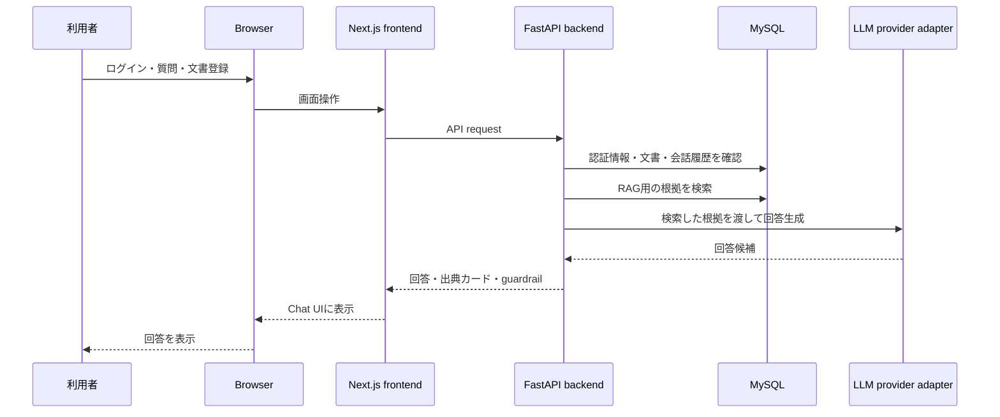

# 構成概要

[English](./02_architecture-overview.en.md)

## 全体構成

## 技術スタック

代表的な技術のみ抜粋しています。

| 領域 | Stack |
| --- | --- |
| Frontend | Next.js 15.5.9、React 19.1.1、TypeScript 5.9.2、Tailwind CSS 4.3.0 |
| Backend | Python 3.11、FastAPI 0.116.1、SQLAlchemy 2.0.43、Alembic 1.16.5 |
| Database | MySQL 8.4 |
| AI・RAG | text extraction（本文抽出）、chunking（チャンク化）、retrieval（検索）、ベクトル検索、出典カード、unsupported guardrail（根拠不足時の回答抑制） |
| Infra | Docker Compose、Nginx、VPS、HTTPS |

## Frontend

Frontendは、公開デモ向けに次の画面を提供します。

- login
- chat
- ドキュメント
- 権限エラー表示

SPAとして実装している主な箇所:

- `/login`と`/login/callback`: Googleログイン開始、認証結果の受け取り、ログイン後の画面遷移
- `/chat`: 会話一覧、メッセージスレッド、回答モデル選択、出典カード、根拠不足時メッセージ
- `/documents`: 文書登録、登録済み文書一覧、文書削除確認
- 共通ヘッダー: Chat/ドキュメント間の移動、言語切替、ログアウト確認
- 画面遷移時の入力状態保持: Chat/ドキュメント間を移動しても、入力途中の内容を失わない

認可判断はfrontendだけで完結させず、backend API側で強制します。

## Backend

Backendは次を担当します。

- Google OAuth callback exchange
- session cookie発行
- roleとownershipの確認
- chat requestの調整
- 文書登録とRAG（Retrieval-Augmented Generation：検索拡張生成）向けの取り込み
- text extraction（本文抽出）、chunking（チャンク化）、ベクトル検索を含むretrieval（検索）
- 回答、出典カード、根拠不足時応答のresponse形状
- LLM provider抽象

Backendは、DDDやクリーンアーキテクチャなどの考え方を部分的に採用し、認証、文書管理、Chat、RAG、LLM provider連携の境界を分けています。これにより、認可、RAGの検索・根拠付け・出典表示、LLM provider切替を独立して変更しやすくし、保守性と拡張性を保ちやすい構成にしています。

## Database

Databaseは次の情報を保存します。

- users
- chat sessionとmessage
- ユーザー所有ドキュメント
- ドキュメント取り込み状態
- 検索可能な文書情報

詳細schema、migration code、実装内部はprivate repositoryで管理します。

## RAG文書Q&Aの流れ

公開できる範囲での流れ:

1. ユーザーがドキュメント画面で文書を登録する。
2. 登録文書はtext extraction（本文抽出）とchunking（チャンク化）を経て、そのユーザーのscope内で検索可能な状態になる。
3. Chat画面の質問は、そのユーザー自身の文書scopeだけを使う。
4. retrieval（検索）は、ベクトル検索を含む複数の検索手段で回答に使うevidence（根拠）を探す。
5. 登録文書内に根拠がある場合は、回答と出典カードを返す。
6. 出典カードには、回答に使った文書名、URL、抜粋を表示する。
7. 見出し、箇条書き、表などを含む文書でも、利用者に見える出典はシンプルなカードとして表示する。
8. 根拠が不足する場合はunsupported guardrail（根拠不足時の回答抑制）を返し、誤解を招く出典カードは表示しない。

このドキュメントでは、公開デモの理解に必要な流れだけを扱います。

## 公開環境構成

公開環境では次を使います。

- VPS
- Docker Compose
- Nginx reverse proxy
- HTTPS
- Google OAuth redirect settings
- httpOnly Cookie session
- user/day利用制限

具体的な環境値は掲載していません。
